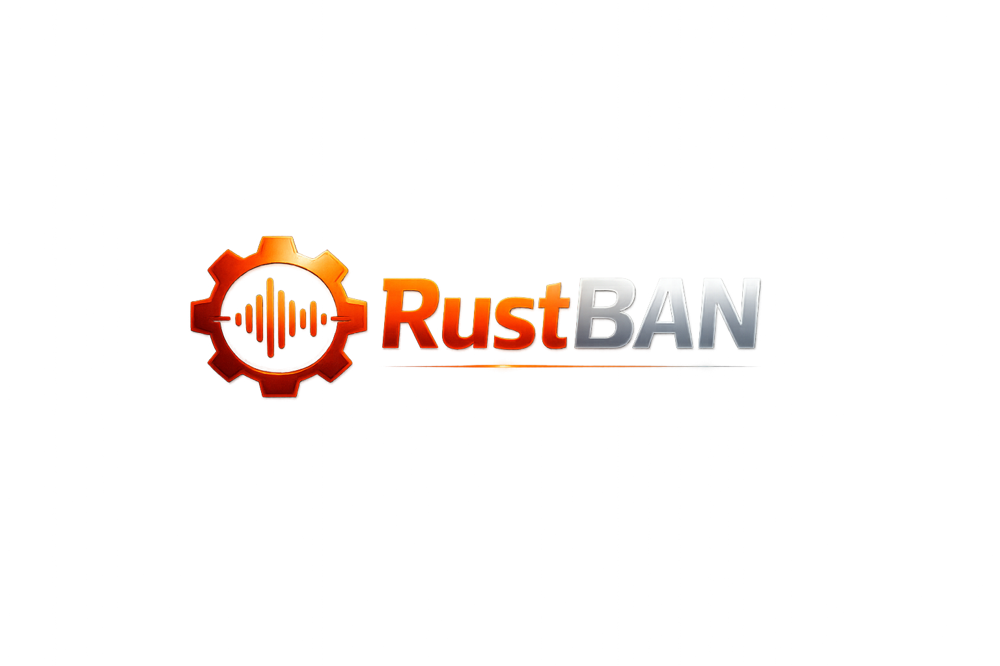
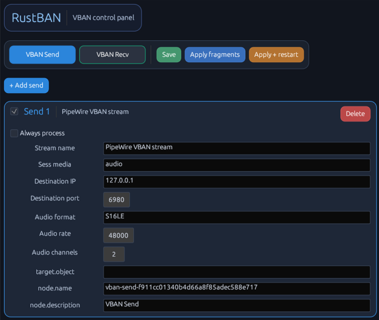
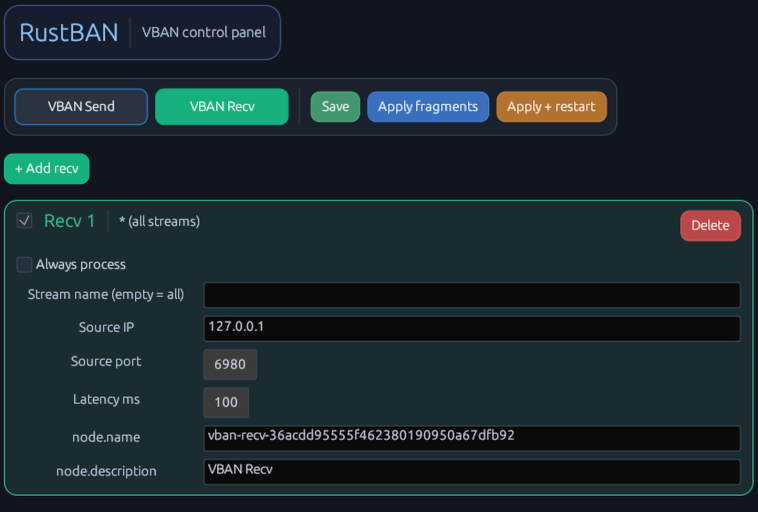

RustBAN is a lightweight desktop app for **VBAN on PipeWire**.

It focuses only on VBAN configuration and avoids unrelated mixer features.  
You can create and edit VBAN send/receive streams, save settings, and generate PipeWire fragments directly from the UI.

## Features

- VBAN Send management
- VBAN Recv management
- Per-stream settings:
  - IP / port
  - stream name
  - audio format, sample rate, channels
  - node name / description
  - `node.always-process`
- Config persistence in TOML
- One-click PipeWire fragment generation
- Optional PipeWire user-service restart

## Screenshots

### Send Menu



### Recv Menu



## Tech

- Rust
- eframe / egui
- serde + toml

## Run

```bash
cargo run
```

## Packaging

RustBAN currently provides dedicated scripts for:

- Debian package (`.deb`)
- AppImage (`.AppImage`)

See `BUILD_DEB_APPIMAGE.md` for exact commands and requirements.
